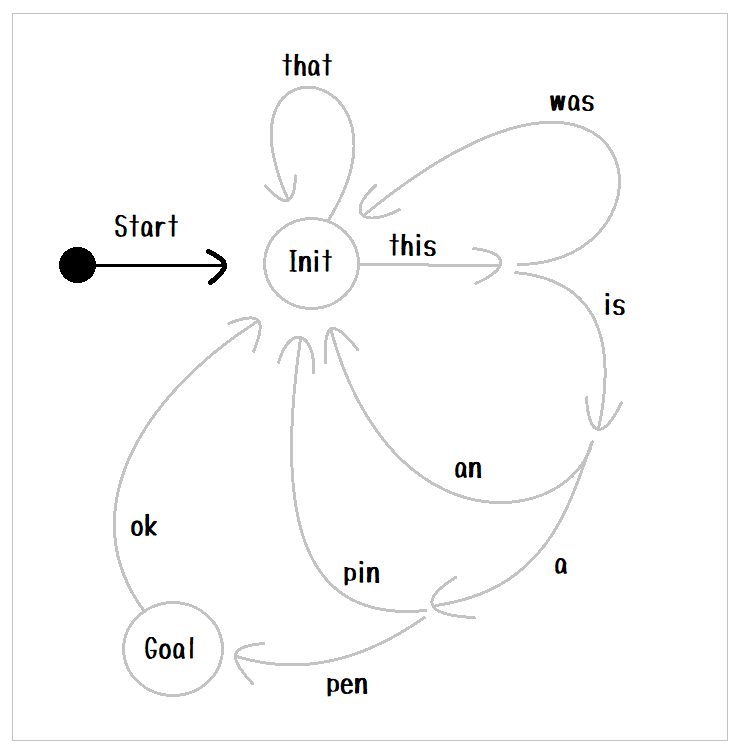

# Edge walk

エッジが木構造をしていることを説明するためのサンプルです  

  
👆  
従来の 状態遷移マシンの構造に比べて、エッジの途中に 疑似の状態 がある感じです。  
エッジのパスを更新しながらループバックしているのと同じです。  

# Set up

```shell
python.exe -m pip install state_machine_py
```

## Auto generation

定義ファイルの自動生成

```shell
# Windows
python.exe -m state_machine_py.const_py_maker "tests/edge_walk/data/const.json" "tests/edge_walk/auto_gen/data/const.py"
#                                             --------------------------------- ----------------------------------------
#                                             Input (.json)                      Output (.py)
```

# Run

```shell
python.exe -m tests.edge_walk.main "tests/edge_walk/conf.toml"
#                                  ---------------------------
#                                  設定ファイル（.toml）
```

👇複数行を一気に貼り付けても動きます。  

Input:  

```
this
is
a
pen
retry

# 'q' と打鍵することで、ステートマシンが実行中でも、ステートマシンを終了させます
q
```

空文字列を指定することで **踏みとどまり** を表現できます。  
