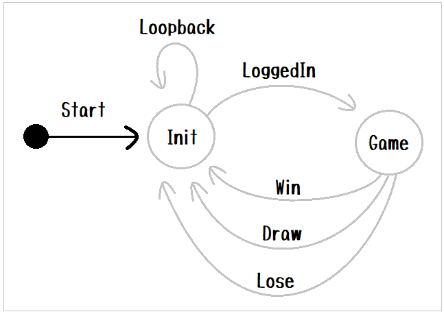
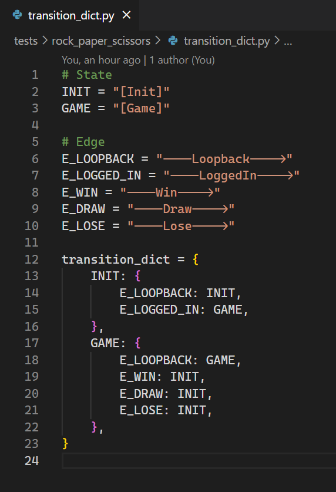
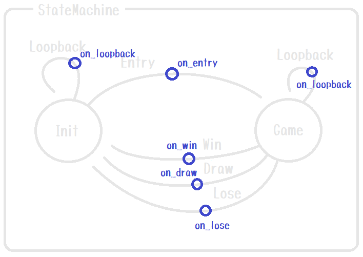

# state-machine-py-example

状態遷移マシン（[state-machine-pyパッケージ](https://pypi.org/project/state-machine-py/)）の使用例（＾～＾）

# Set up

```shell
cd tests/rock_paper_scissors

# Test
python.exe -m pip install --index-url https://test.pypi.org/simple/ --no-deps state_machine_py

# Product
python.exe -m pip install state_machine_py
```

# Run

```shell
cd tests/rock_paper_scissors
python.exe -m main
```

# Concept (Layer 1. Transition map)

  
👆  

説明１  

* 上図は じゃんけんゲーム の StateMachine（状態遷移マシン） です
* 円は  State（状態） を表しています
* State から別の State に向かって伸びている線を Edge（辺）と呼びます。  
  エッジには向きがあります。また、このプログラムではエッジをツリー状にすることができます

説明２  

* State は、StateMachineの中で一意の名前を持ってください
* Edge は、 Stateの中で一意の名前を持ってください

```python
state_machine = StateMachine(
    context=Context(),
    state_creator_dict=state_creator_dict,
    transition_dict=transition_dict)
```

👆  
ステートマシンの生成の説明は長くなるので `main.py` ソースコードを読んでください

```python
state_machine.start("[Init]", __lines_getter)
```

👆  
ステートマシンの起動の説明は長くなるので `main.py` ソースコードを読んでください

* State の名前はソースコード上では（必須ではありませんが）説明のために `[ ]` で囲むものとします

```python
from state_machine_py.abstract_state import AbstractState
from context import Context

class InitState(AbstractState):
    # 中略

    def exit(self, context, line, edge_path):

        if line=="LOGIN":
            return '----LoggedIn---->'

        return '----Loopback---->'
```

👆  
遷移する方法は State の exit 時に、次の（下位の）エッジの名前を指定してください  

  
👆

* State と State のつながりは、 `transition_dict` という Dictionary に  
  格納しておきます。  
  ツリー構造になっていて、トップレベルとリーフには State が並びます。  
  その途中は エッジ です。  
* ツリー構造を下りるというのは、現在のエッジ位置のパスを１つ伸ばして　現在のステートへループバックすることと同じです

# Concept (Layer 2. Decoration event)

  
👆  

説明１  

* Edge には、任意の名前の `on_xxxx` といったものを いくつでも付けることができます。  
  これは本書では `xxxx` を イベント（Event）、 `on_xxxx` を イベントハンドラ（EventHandler）と呼ぶとします
* `entry()` に紐づく `on_entry()` と、 `exit()` に紐づく `on_exit` だけ最初から用意されています

説明２  

`Layer 1` で状態遷移の実装に注力できるように、それ以外のコードは `Layer 2` に実装してください。  

# Context 変数とは

Context は StateMachine の外部から任意に与えられる変数です。  
このアルゴリズムは Context の中身について関知しません

## 内部実装

# State

```plain
State machine              State
-------------            ---------

    O  Start
    |
    |
 arrive(next_state_name)
    |
    |
    +--------------------- entry()       // 初期化処理や、CleanUp が主な役割に
                             |           // なるかと思います
                             |
                             |           // 戻り値として None を返すと（オーバーライドしないのと同じ）
                             |           // 外部から与えた入力手段で 文字列入力を待機します
                             |
                             |           // 戻り値として 文字列のリストを返すと
                             |           // その文字列を入力として　次の処理が走ります
    +------------------------+
    |
    |
    O  entry() で line を返していればそれを優先して続行、
    |  そうでなければ ここで 標準入力（またはサーバー）から文字列の受信があるまで待機
    |
    |
  leave(line)
    |
    |
    +--------------------- exit()       // 実行したい処理はここに書くことに
                             |          // なるかと思います
                             |
                             |          // 戻り値として 次の（下位の）エッジの名前を
                             |          // 返してください
    +------------------------+
    |
    |
    O  Start (繰り返し)
```
