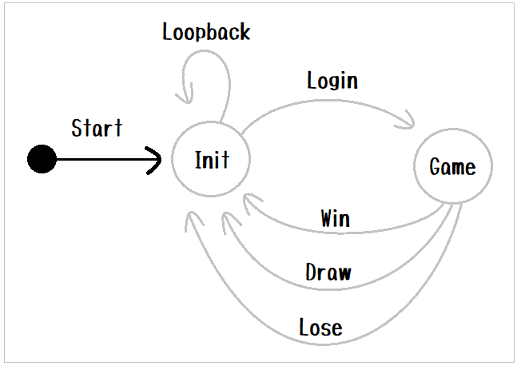

# Example - Rock Paper Scissors

状態遷移マシン（[state-machine-pyパッケージ](https://pypi.org/project/state-machine-py/)）の使用例（＾～＾）

# Set up

```shell
python.exe -m pip install state_machine_py
```

## Auto generation

定数定義ファイルの自動生成:  

```shell
# Windows
python.exe -m state_machine_py.const_py_maker "tests/rock_paper_scissors/data/const.json" "tests/rock_paper_scissors/auto_gen/data/const.py"
#                                             ------------------------------------------- --------------------------------------------------
#                                             Input (.json)                                Output (.py)
```

状態遷移図の自動生成:  

```shell
python.exe -m state_machine_py.graph_generator "tests/rock_paper_scissors/conf.toml" "transition_file" "output_graph_text_file"
#                                              ------------------------------------- ----------------- ------------------------
#                                              1.                                    2.                3.
# 1. 設定ファイル（TOML形式）
# 2. 入力ファイル（JSON形式）を指すプロパティの名前
# 3. 出力ファイル（テキストファイル形式）を指すプロパティの名前
```

# Run

```shell
python.exe -m tests.rock_paper_scissors.main "tests/rock_paper_scissors/conf.toml"
#                                            -------------------------------------
#                                            設定ファイル（.toml）
```

```plain
Your name:
```

👆 Entry your name  

```plain
Rock-paper-scissors(R,P,S):
```

👆 Rock is R, Paper is P, Scissors is S.  
q is quit.  

# Concept (Layer 1. Transition map)

  
👆  

説明１  

* 上図は じゃんけんゲーム の StateMachine（状態遷移マシン） です
* 円は  State（状態） を表しています
* State から別の State に向かって伸びている線を Edge（辺）と呼びます。  
  エッジには向きがあります。また、このプログラムではエッジをツリー状にすることができます

説明２  

* State は、StateMachineの中で一意の名前を持ってください
* Edge は、 Stateの中で一意の名前を持ってください

```python
state_machine = StateMachine(
    context=Context(),
    state_gen=state_gen,
    transition=transition)
```

👆 ステートマシンの生成の説明は長くなるので `main.py` ソースコードを読んでください  

```python
state_machine.start([INIT])
```

👆 ステートマシンの起動の説明は長くなるので `main.py` ソースコードを読んでください  

* State の名前はソースコード上では（必須ではありませんが）説明のために `[ ]` で囲んでいます

```python
    def run(self):
        """標準入力からの入力を受け取ります"""
        while True:
            # 末尾に改行は付いていません
            line = input()  # ブロックします

            # 'q' と打鍵することで、ステートマシンが実行中でも、ステートマシンを終了させます
            if line.lower() == 'q':
                self._quit = True
                self.state_machine.terminate()
                break

            self.state_machine.input_queue.put(line)
```

👆 ステートマシンに文字を渡す例

```python
from state_machine_py.abstract_state import AbstractState
from context import Context

class InitState(AbstractState):
    # 中略

    def update(self, req):

        if line=="LOGIN":
            return '-LoggedIn->'

        return '-Loopback->'
```

👆 遷移する方法は State の update 時に、次の（下位の）エッジの名前を指定してください  

* Edge の名前はソースコード上では（必須ではありませんが）説明のために `- ->` で囲んでいます

  
👆

* State と State のつながりは、 `transition` という Dictionary に  
  格納しておきます。  
  ツリー構造になっていて、トップレベルとリーフには State が並びます。  
  その途中は エッジ です。  
* ツリー構造を下りるというのは、現在のエッジ位置のパスを１つ伸ばして　現在のステートへループバックすることと同じです

# Concept (Layer 2. Decoration event)

  
👆  

説明１  

* Edge には、任意の名前の `on_xxxx` といったものを いくつでも付けることができます。  
  これは本書では `xxxx` を イベント（Event）、 `on_xxxx` を イベントハンドラ（EventHandler）と呼ぶとします

説明２  

`Layer 1` で状態遷移の実装に注力できるように、それ以外のコードは `Layer 2` に実装してください。  

# Context 変数とは

Context は StateMachine の外部から任意に与えられる変数です。  
このアルゴリズムは Context の中身について関知しません

## 内部実装

# State

```plain
State machine              State
-------------            ---------

    O  Start
    |
    |
 self._state = StateMachineHelper.create_state(state_gen, [INIT]) // 状態遷移を行います
    |
    |
    |
    |
  _leave()                              // 遷移先を算出します
    |
    |
    +--------------------- update()      // 実行したい処理はここに書くことに
                             |          // なるかと思います
                             |
                             |          // 例えば req.intermachine.enqueue_myself("This is a command")
                             |          // を実行すると 自分自身（ステートマシン）の入力キューに
                             |          // 文字列を入力できます
                             |
                             |          // 例えば req.intermachine.dequeue_myself()
                             |          // を実行すると 自分自身（ステートマシン）の入力キューから
                             |          // 文字列を取り出せます
                             |
                             |          // 戻り値として 次の（下位の）エッジの名前を
                             |          // 返してください
    +------------------------+
    |
    |
    O  Start (繰り返し)
```

# data/const.json

```py
MACHINE_A = "MachineA"
```

👆 State machine name. Pascal Case

```py
INIT = "Init"
GAME = "Game"
```

👆 State name. Pascal Case. 図で使われます

```py
E_LOOPBACK = "loopback"  # 汎用
E_LOGIN = "login"
E_LOSE = "lose"
E_WIN = "win"
E_DRAW = "draw"
```

👆 Edge name. snake_case. 図で使われます
