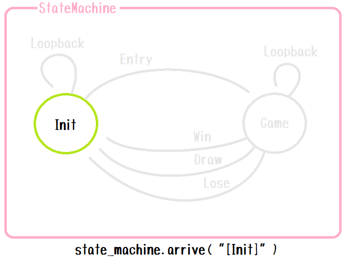

# state-machine-py-example

状態遷移マシン（[state-machine-pyパッケージ](https://pypi.org/project/state-machine-py/)）の使用例（＾～＾）

# Set up

```shell
# Test
python.exe -m pip install --index-url https://test.pypi.org/simple/ --no-deps state_machine_py

# Product
python.exe -m pip install state_machine_py
```

# Run

```shell
cd tests
python.exe -m main
```

# Concept (Layer 1. Transition map)

  
👆

* StateMachine（状態遷移マシン） はいくつかの State（状態） を持ちます
* State と State は向きのある Edge（辺）でつながっています

  
👆

* State は、StateMachineの中で一意の名前を持ってください
* Edge は、 Stateの中で一意の名前を持ってください

  
👆

* StateMachine を使い始める最初に、 `state_machine.arrive(...)` を使って  
  `[Init]` という名前のState を選んでください。  
  State の名前はソースコード上では `[ ]` で囲むものとします

  
👆

* 標準入力から `John` と文字列を打鍵されたとします。  
  これを `state_machine.leave(...)` を使って  
  StateMachine に文字列を渡してください。

  
👆

* Stateの仕事は、文字列をパースすることです。  
  例えば `John` のパースに成功すれば `----Entry---->` edge の方へ、  
  パースに失敗すれば `----Loopback---->` edge の方へ進むとしましょう。  
  Edge の名前はソースコード上では `---- ---->` で囲むものとします

  
👆

* State と State のつながりは、 `transition_dict` という Dictionary に  
  格納しておきます。  
  現在のStateの `[Init]` と、選ばれたEdgeが例えば `----Entry---->` のとき、  
  `[Init]----Entry---->` がキーとなります。  
  紐づく値は `[Game]` ですので、自動で `state_machine.arrive( "[Game]" )` が  
  行われます
* あとは `state_machine.leave(...)` の繰り返しです

# Concept (Layer 2. Decoration event)

  
👆

* State には、任意の名前の `on_xxxx` といったものを いくつでも付けることができます。  
  これは本書では `xxxx` を イベント（Event）、 `on_xxxx` を イベントハンドラ（EventHandler）と呼ぶとします

  
👆

* また、すべての State には、 `state_machine.arrive(...)` の開始時に紐づいた `entry` event と、  
  `state_machine.leave(...)` の終了時に紐づいた `exit` event を持ちます


👆

* StateMachine 上の EventHandler だけを集めた DecoratedStateMachine があると考えてください。  
  DecoratedStateMachine は、 StateMachine と同じように動きます

  
👆

* StateMachine の生成時に、  
  DecoratedStateMachine のすべての EventHandler に、 **Context** を渡すことができると考えてください。  
  Context は StateMachine の外部から任意に与えられる変数です。  
  Context の内容が何かは StateMachine および すべての State は知りません
* DecoratedStateMachine の EventHandler は、 Context の内容が何かを知っていて、  
  任意に Context を使えると考えてください
* StateMachine は、 State のつながりだけに注力して実装してください
* DecoratedStateMachine は、 メッセージをPrintしたり、Context変数を編集したりするのに使ってください

## Version 3

ステートに遷移し、 `entry(context)` のあと、続けてただちに 次のステートに遷移したい場合（通り過ぎたい場合）、  
次の `state_machine.leave(context, line)` に渡したい line 引数を戻り値として返すことで、  
ただちに `state_machine.leave(context, line)` が優先的に割り込んで実行されます。  
`entry(context)` が None を返した場合、ただちに通り過ぎることはされません。  

# State

```plain
O  Start
|
|
|
|
+----arrive(state_name)
          |
          |
          O  entry ----------+  初期化処理や、CleanUp が主な役割になるかと思います
                             |
                             |
                             |
                        +----+----+ Return is ...
                        |         |
                        |         |
                  None  O         O  Your defined line
            (Default)   |         |
                        |         |
                        +----+----+
                             |
                             |
          +------------------+  標準入力（またはサーバー）からの文字列受信を待機する働きを挟みたいなら、
          |                     None を返してください（ entry をオーバーライドしない場合の既定）
          |
+---------+                     文字列を外部から受け取る代わりに、
|                               直接指定し、C 言語の switch ～ case 文のような働きをしたいなら、
|                               entry(..) からその文字列を返してください
|
|
O  entry で line を返していればそれを優先して続行、
|  そうでなければ ここで 標準入力（またはサーバー）から文字列の受信があるまで待機
|
|
|
|
+----leave(line)
          |
          |
     parse line and choice
          |
          |
     +----+----+
     |    |    |
     |    |    |
     O    O    O  Your defined events  - 実行したい処理はここに書くことに
     |    |    |                         なるかと思います
     |    |    |
     +----+----+
          |
          |
          O  exit
          |
          |
+---------+
|
|
|
|
O  Start (繰り返し)
```