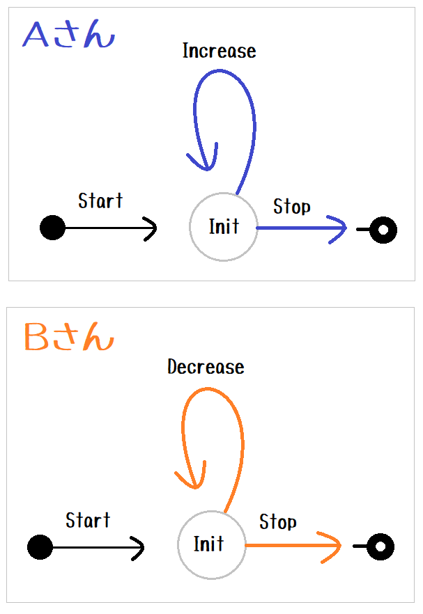

# task_sharing

異なるプログラム Aさんと Bさんが うまく連携することを示します。  

  

```plain
Aさん: 渡されたボールに奇数なら書かれていたら 3倍して1を加えた数に書き直します
      1 が書かれていたら処理を終了します
      どちらにしろ Bさんにボールを投げ返します

Bさん: 渡されたボールに偶数が書かれていたら 2で割った数に書き直します
      1 が書かれていたら処理を終了します
      どちらにしろ Aさんにボールを投げ返します

ボールをキャッチしてくれる人がいなければ このプログラムは終了します
```

# Run

```shell
python.exe -m tests.task_sharing.main
```

Input 1:

```plain
6
```

Input 2:

```plain
27
```
