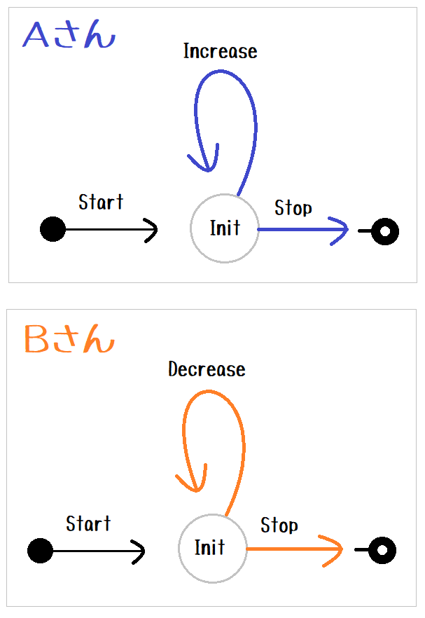

# two_machines_catchbal

異なるプログラム Aさんと Bさんが うまく連携することを示します。  

  

```plain
Aさん: 渡されたボールに奇数なら書かれていたら 3倍して1を加えた数に書き直します
      1 が書かれていたら処理を終了します
      どちらにしろ Bさんにボールを投げ返します

Bさん: 渡されたボールに偶数が書かれていたら 2で割った数に書き直します
      1 が書かれていたら処理を終了します
      どちらにしろ Aさんにボールを投げ返します

ボールをキャッチしてくれる人がいなければ このプログラムは終了します
```

# Set up

```shell
python.exe -m pip install state_machine_py
```

## Auto generation

定義ファイルの自動生成

```shell
# Windows
python.exe -m state_machine_py.const_py_maker "tests/two_machines_catchball/data/const.json" "tests/two_machines_catchball/auto_gen/data/const.py"
#                                             ---------------------------------------------- -----------------------------------------------------
#                                             Input (.json)                                   Output (.py)
```

状態遷移定義ファイルの自動生成:  

```shell
# Windows
python.exe -m state_machine_py.transition_py_maker "tests/two_machines_catchball/data/const.json" "tests/two_machines_catchball/machine_a/data/transition.json" "tests/two_machines_catchball/auto_gen/machine_a/data/transition.py" "tests.two_machines_catchball.auto_gen.data.const" "machinea_transition_obj"
python.exe -m state_machine_py.transition_py_maker "tests/two_machines_catchball/data/const.json" "tests/two_machines_catchball/machine_b/data/transition.json" "tests/two_machines_catchball/auto_gen/machine_b/data/transition.py" "tests.two_machines_catchball.auto_gen.data.const" "machineb_transition_obj"
```

# Run

```shell
python.exe -m tests.two_machines_catchball.main
```

Input 1:

```plain
6
```

Input 2:

```plain
27
```
